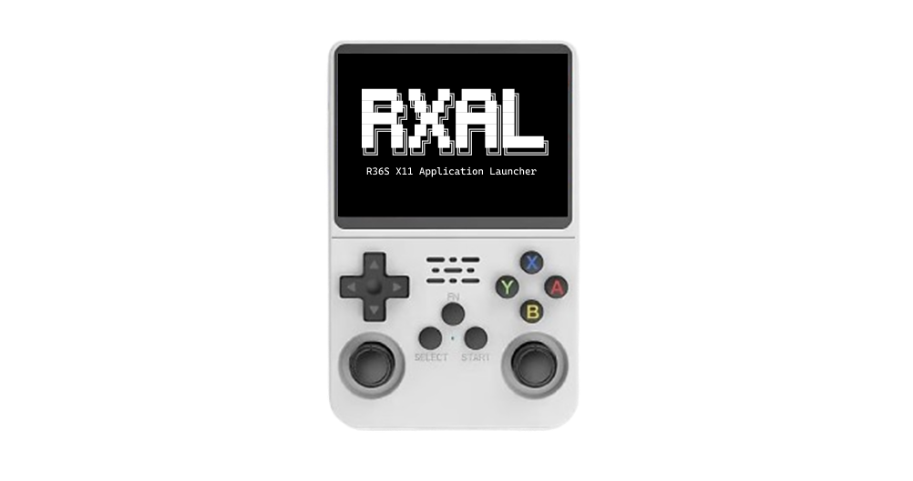

RXAL is a simple Bash script for the R36S (the cheap but great handheld retro gaming device) to launch native Linux X11 GUI apps from the EmulationStation UI.

## Installation & Usage

**Download the repo as zip (or clone it) and move it straight to `EASYROMS/ports/` folder of your SD card.**

The main script will be inside the `RXAL` directory, the wrapper scripts (eg. `Terminal.sh` or `Firefox.sh`) will be accessible from the Ports system in the EmulationStation UI. You can delete the wrappers you don't need, you can also create new wrappers quite easily (just look at the scripts for the existing wrappers!).

**Base dependencies will be installed the first time you run the script (make sure you have internet!).** You can also install the base dependencies manually with the following command:

```bash
sudo apt install xinit xinput openbox onboard qjoypad
```

## Included Wrappers

Below is a list of included wrapper scripts:

| **Script Name** | **App**        | **Function**                  |
|-----------------|----------------|-------------------------------|
| Terminal.sh     | xfce4-terminal | Terminal emulator             |
| Firefox.sh      | firefox-esr    | Web browser                   |
| Thunar.sh       | thunar         | File manager                  |
| Mousepad.sh     | mousepad       | Text editor                   |
| Drawing.sh      | mousepad       | Paint software                |

## How Does It Work?

The main `RXAL.sh` script basically just opens a new X11 sessions via `xinit` and launches the given app/command (the first argument `$1`). It also launches QJoyPad to control the mouse via the joysticks and also launches Onboard (screen keyboard) if the `--keyboard` argument is passed. It uses Openbox to manage the windows.

## Writing a Wrapper

Writing a wrapper script is quite straightforward: shebang line + the calling of the actual RXAL script with the necessary arguments and env variables. Below are some examples showcasing the arguments and env variables:

Wrapper script without on-screen keyboard:

```bash
#!/bin/bash
/roms/ports/RXAL/RXAL.sh thunar
```

Wrapper script _with_ on-screen keyboard:

```bash
#!/bin/bash
/roms/ports/RXAL/RXAL.sh mousepad --keyboard
```

Wrapper script with a custom QJoyPad layout file (`Custom.lyt` must be in `/root/.qjoypad3`, you can hardcode it in a heredoc and copy it there in the beginning of the wrapper script):

```bash
#!/bin/bash
RXAL_LAYOUT=Custom /roms/ports/RXAL/RXAL.sh app --keyboard
```

Wrapper script whose package name is different than it's command:

```bash
#!/bin/bash
RXAL_PACKAGE=app-package /roms/ports/RXAL/RXAL.sh app --keyboard
```

## Troubleshooting

RXAL writes the output of the last launch to `RXAL/debug.log`. Check that file to see the errors encountered.
